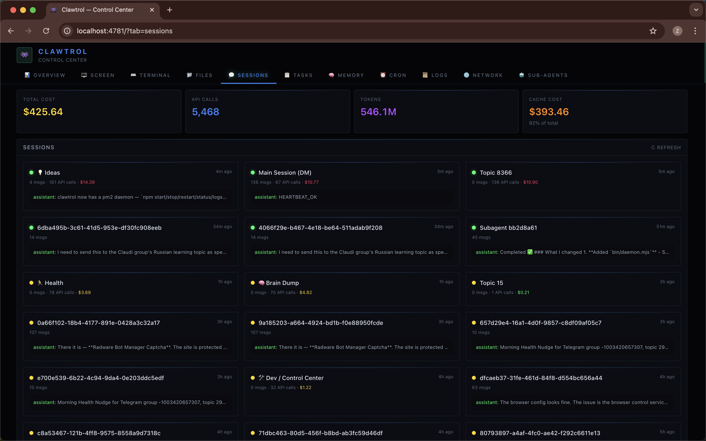
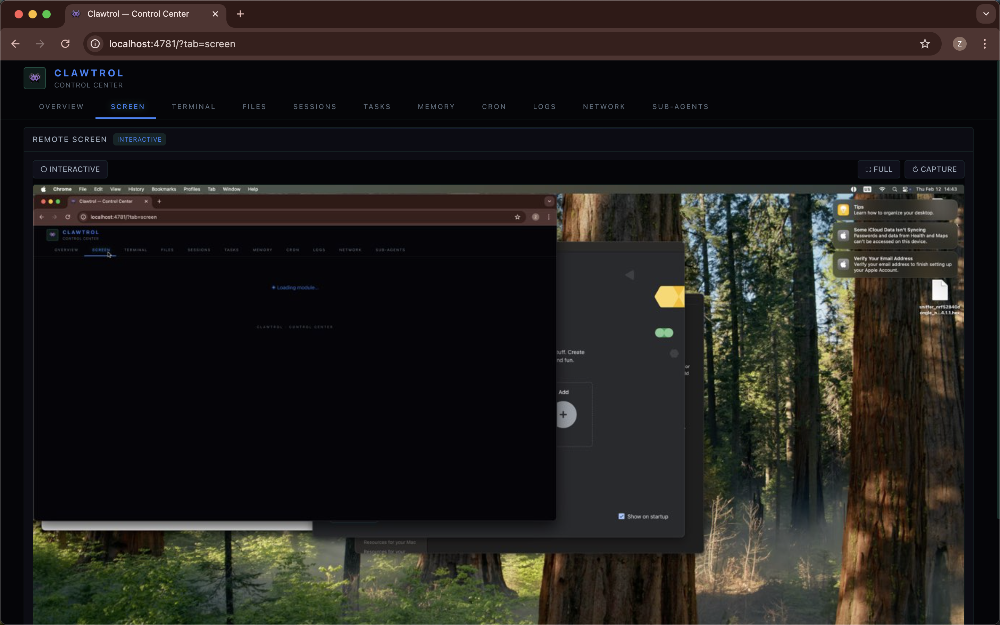

# 🎛️ Clawtrol

A sleek, modular dashboard for [OpenClaw](https://openclaw.ai) AI agents. Monitor your machine, chat with your agent, browse files, manage tasks — all from one place.

Built for headless setups (Mac minis, VPS, Raspberry Pi) but works anywhere OpenClaw runs.


<details>
<summary><strong>More screenshots</strong></summary>

**Sessions** — monitor all OpenClaw sessions, costs, and token usage


**Tasks** — kanban board with project filters


**Screen** — remote screen viewer with click interaction


**Memory** — browse agent memory files


**Cron** — manage scheduled jobs


</details>

<details>
<summary><strong>Theme presets</strong></summary>

**Midnight** — clean dark minimal


**Catppuccin** — warm pastel dark


**Solar** — solarized light


</details>

## 🚀 Quick Start

```bash
npm install -g clawtrol
clawtrol init
cd clawtrol
clawtrol start
```

Open [http://localhost:4781](http://localhost:4781).

> The setup wizard walks you through project name, modules, theme, and API config — then scaffolds everything for you.

### Without global install
```bash
npx clawtrol init
cd clawtrol
npm start
```

### From source
```bash
git clone https://github.com/nachoandmikey/clawtrol.git
cd clawtrol
npm install
clawtrol start
```

## Running

### Development
```bash
npm run dev
```

### Production (daemon via pm2)
```bash
clawtrol start     # build + start on port 4781 (or next available)
clawtrol status    # check if running
clawtrol logs      # view logs
clawtrol restart   # restart
clawtrol stop      # stop and remove from pm2
```

> pm2 is included with OpenClaw. Clawtrol auto-detects a free port if 4781 is taken.
> 
> Also works as npm scripts: `npm start`, `npm stop`, `npm run status`, etc.

## ✨ Features

| Module | What it does |
|--------|-------------|
| **Overview** | System stats — CPU, RAM, disk, uptime, weather |
| **Screen** | Remote screen viewer with click interaction (perfect for headless Macs) |
| **Terminal** | Full web terminal via ttyd |
| **Files** | Browse, read, and download files from the machine |
| **Sessions** | View and chat with OpenClaw sessions in real-time |
| **Tasks** | Lightweight kanban board for task tracking |
| **Memory** | Browse your agent's memory and markdown files |
| **Cron** | View and manage cron jobs |
| **Logs** | Gateway log viewer with filtering |
| **Network** | Tailscale peers and running processes |
| **Sub-agents** | Monitor and manage spawned sub-agents |

Every module is **optional** — enable only what you need.

## ⚙️ Configuration

Edit `clawtrol.config.ts` to customize:

```typescript
const config: ClawtrolConfig = {
  title: 'My Dashboard',
  
  // Enable only the modules you need
  modules: [
    'overview',
    'screen',
    'terminal',
    'files',
    'sessions',
  ],

  theme: {
    mode: 'dark',        // 'dark' | 'light' | 'system'
    accent: '#3b82f6',   // any CSS color
  },

  openclaw: {
    configPath: '~/.openclaw/config.json',
  },

  port: 4781,
};
```

### Module Details

<details>
<summary><strong>🖥️ Screen</strong> — Remote screen viewer</summary>

View your machine's screen remotely and click to interact. Uses native macOS `screencapture` for fast captures.

Perfect for headless Mac minis — see what's happening without VNC.

**Requirements:** macOS with `screencapture` available.
</details>

<details>
<summary><strong>⌨️ Terminal</strong> — Web terminal</summary>

Full terminal access in the browser via [ttyd](https://github.com/tsl0922/ttyd).

**Requirements:** `ttyd` installed (`brew install ttyd`).
</details>

<details>
<summary><strong>💬 Sessions</strong> — Chat with your agent</summary>

View all OpenClaw sessions and send messages directly. See conversation history, session status, and costs.

**Requirements:** OpenClaw gateway running.
</details>

<details>
<summary><strong>📋 Tasks</strong> — Kanban board</summary>

Simple task management with columns: Backlog → In Progress → In Review → Done.

Data stored locally in `~/.openclaw/control-center/tasks.json`.
</details>

## 🌐 Remote Access via Tailscale

Clawtrol is built for headless machines. The recommended way to access it remotely is via [Tailscale](https://tailscale.com) — a zero-config mesh VPN.

### Setup

1. **Install Tailscale** on your headless machine and your laptop/phone:
   ```bash
   # macOS
   brew install tailscale
   
   # Linux
   curl -fsSL https://tailscale.com/install.sh | sh
   ```

2. **Start Tailscale** on both devices:
   ```bash
   sudo tailscale up
   ```

3. **Find your machine's Tailscale IP:**
   ```bash
   tailscale ip -4
   # e.g. 100.64.0.2
   ```

4. **Access Clawtrol** from anywhere on your tailnet:
   ```
   http://100.64.0.2:4781
   ```

### Optional: MagicDNS

With [MagicDNS](https://tailscale.com/kb/1081/magicdns) enabled, access your dashboard by machine name:
```
http://my-mac-mini:4781
```

### Optional: HTTPS with Tailscale Certs

For HTTPS access (needed for clipboard API, notifications, etc.):
```bash
tailscale cert my-mac-mini.your-tailnet.ts.net
```
Then configure Next.js to use the generated certs, or put Caddy/nginx in front.

### Security Note

Clawtrol has **no built-in auth** — it assumes you're accessing it over a trusted network (like Tailscale). Don't expose port 4781 to the public internet without adding authentication.

## 🎨 Themes

Four built-in presets, selectable during `npx clawtrol init` or in config:

| Preset | Vibe |
|--------|------|
| 🟢 **Nova** (default) | Cyberpunk command center — Orbitron + JetBrains Mono, cyan glow, near-black BG |
| 🔵 **Midnight** | Clean dark minimal — Inter font, slate tones, blue accents |
| 🟣 **Catppuccin** | Warm pastel dark — cozy dev vibes, mauve/pink/sky accents |
| ☀️ **Solar** | Solarized light — easy on the eyes for daytime |

```typescript
theme: {
  preset: 'nova',        // 'nova' | 'midnight' | 'catppuccin' | 'solar'
  mode: 'dark',          // 'dark' | 'light' | 'system'
  accent: '#00ffc8',     // override accent color (optional)
}
```

## 🏗️ Architecture

```
src/
├── app/
│   ├── api/              # API routes per module
│   │   ├── screen/
│   │   ├── sessions/
│   │   ├── plugins/[...slug]/  # Plugin API catch-all
│   │   └── ...
│   ├── page.tsx          # Dashboard shell
│   └── layout.tsx        # ThemeProvider + fonts
├── components/
│   ├── modules/          # One folder per module
│   │   ├── OverviewModule/
│   │   │   ├── index.tsx
│   │   │   └── widgets/  # Widget components
│   │   ├── SessionsModule/
│   │   └── ...
│   ├── Shell.tsx         # Sidebar + mobile drawer
│   └── ThemeProvider.tsx # Preset theme application
├── lib/
│   ├── config.ts         # Config types + MODULE_META
│   ├── themes.ts         # Theme presets (nova, midnight, catppuccin, solar)
│   ├── widgets.ts        # Widget registry
│   └── plugins.ts        # Plugin loader
├── bin/
│   ├── clawtrol.mjs      # CLI + setup wizard
│   └── daemon.mjs        # pm2 daemon management
```

Each module is self-contained — its own component + API route. Disable a module and its code isn't even loaded.

## 📦 Tech Stack

- **Next.js 16** — App Router
- **React 19** — RSC + Client Components
- **Tailwind CSS 4** — Styling
- **TypeScript** — Type safety
- **Radix UI** — Accessible primitives

## 🤝 Contributing

PRs welcome! Each module is independent, so you can add new ones without touching existing code.

```bash
# Add a new module
1. Create src/components/modules/YourModule.tsx
2. Add API route at src/app/api/your-module/route.ts
3. Register in src/lib/config.ts
4. That's it
```

## 📄 License

MIT — use it however you want.

---

Built with 👾 by Mikey Nova & [Nacho](https://github.com/nachoiacovino)
